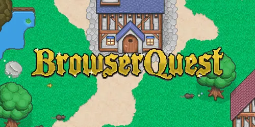

# BrowserQuest Quick Start


BrowserQuest is a free massively multiplayer online role-playing HTML5/JavaScript game 😮‍💨 created by French developer Little Workshop and the Mozilla Foundation.

<p align="center">
  
</p>

## Technology 
BrowserQuest is a demonstration of a number of modern web technologies. It is written for the web platform, utilizing WebSockets for multiplayer networking, and is playable from modern web browsers. The client makes use of canvas elements to render the graphics, web workers to initialize the map without affecting the rest of the page, localStorage to save progress, media queries to dynamically resize the game to the device, and HTML audio to render the sound. The server is written in JavaScript, and runs in Node.js. The server and browser communicate using WebSockets. [[Wikipedia](https://en.wikipedia.org/wiki/BrowserQuest)]

I only needed to update the Redis-related code, as it was originally written for an older version of the Redis client library. Redis is an in-memory data store often used for caching, real-time analytics, and message brokering. The newer version of the client introduced breaking changes in its API, which required adjustments to how connections were established and commands were executed.

## Gameplay

In BrowserQuest, players can interact with each other using the in-game chat system, or by working together to defeat enemies.[2] There are achievements available to unlock as one plays. Loot is dropped when players defeat the enemies, which can be picked up by any player. Loot includes the invincibility potion, which changes a player's outfit to appear like the Firefox logo, and various gear. At one point in time, the system recorded over 1,900 concurrent users playing at the same time. [[Wikipedia](https://en.wikipedia.org/wiki/BrowserQuest)]

## Requirements

- [Node.js](https://nodejs.org/) (v14+ recommended)
- [npm](https://www.npmjs.com/) (comes with Node.js)
- [Redis](https://redis.io/) (for the backend database)

## 1. Open the Terminal and Clone the repository

```sh
git clone git@github.com:gonzalo-munillag/BrowserQuest.git
cd Browserquest
```

## 2. Install dependencies

```sh
npm install
```

## 3. Start Redis

Make sure Redis is running.

On macOS (with Homebrew):

```sh
brew install redis
brew services start redis
```

Or, simply run:

```sh
redis-server
```

## 4. Start the game server

```sh
node server/js/main.js
```

## 5. Open the game in your browser

Go to: [http://localhost:8000/](http://localhost:8000/)

---

### Notes

- The default port is `8000`. If you want to change it, edit `server/config.json` or create `server/config_local.json`.
- For more details, see the full documentation in the [wiki](https://github.com/browserquest/BrowserQuest/wiki).
- For Windows or Linux, install Redis and Node.js using your platform's package manager or from their official websites.
- If you plan to clone the project and create your own GitHub repository, run this command locally to ensure the default Git buffer size can handle the large project size when pushing:

    ```sh 
    git config --global http.postBuffer 157286400
    ```

    That one worked well in my Mac. This one for Linux:

    ```sh 
    git config http.postBuffer 524288000
    ```

---

## Credits & License

- Code is licensed under MPL 2.0. Content is licensed under CC-BY-SA 3.0. See the LICENSE file for details.
- Originally created by [Little Workshop](http://www.littleworkshop.fr) and the Mozilla Foundation.
